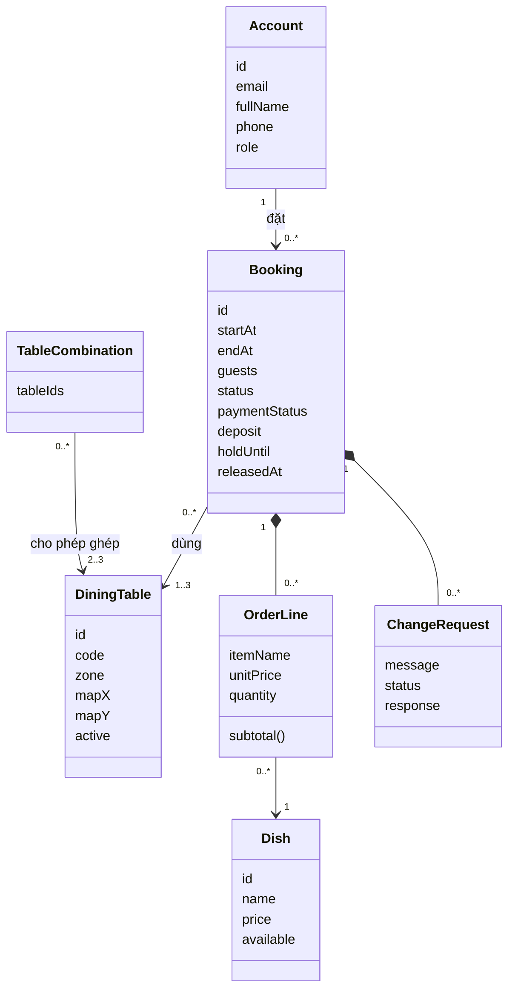
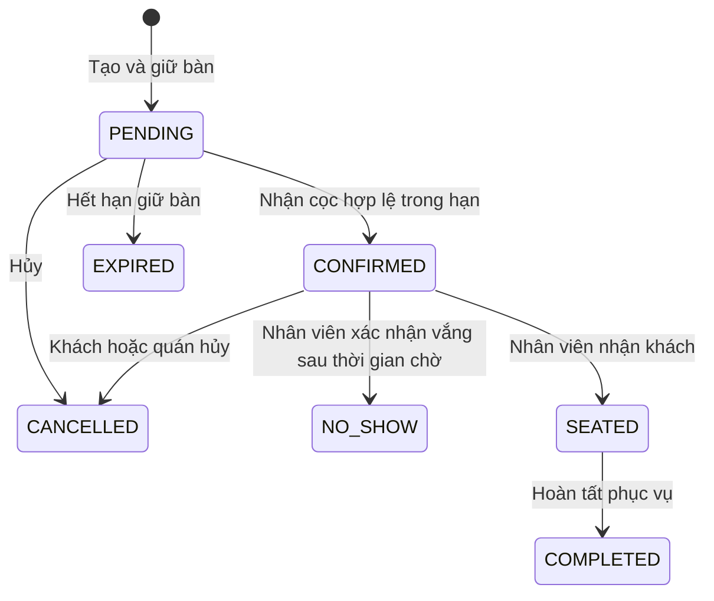
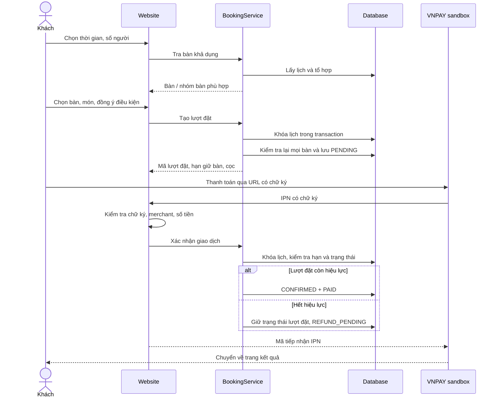

# Phân tích thiết kế — phiên bản đầu

GiaViên có hai tầng: B01–B08 và B10 ở tầng 1 quanh vườn, B11–B20 ở tầng 2 quanh khoảng thông tầng. B09 được ngừng phục vụ để chừa lối đi từ cửa vào; lịch đặt cũ vẫn giữ liên kết đến bàn này và hiển thị thông báo cần sắp xếp lại. `DiningTable.floor` xác định tầng; `FloorPlan.canJoin` chỉ cho phép ghép 2–3 bàn liên tiếp trên cùng hàng/cột và cùng tầng. ID vật lý của bàn cũ được giữ nguyên để bảo toàn liên kết đặt bàn; tên hiển thị lấy từ `code`.

## Tác nhân và use case

Đặt cọc dùng VNPAY Sandbox. `VnpayPaymentService` lưu từng lần thanh toán trong `payment_attempt`, dùng lại giao dịch đang chờ và cấp mã mới khi lần trước thất bại. `VnpayGateway` ký URL/kiểm tra chữ ký; IPN đã xác minh mới gọi nghiệp vụ xác nhận cọc. Return URL chỉ hiển thị và thăm dò trạng thái, không cập nhật tiền. Khoản thu thêm được theo dõi riêng để nhân viên hoàn và ghi nhận mã đối soát.

| Tác nhân             | Use case                                                                                                           |
| -------------------- | ------------------------------------------------------------------------------------------------------------------ |
| Khách chưa đăng nhập | Xem thực đơn, đăng ký, đăng nhập                                                                                   |
| Khách hàng           | Tra bàn, chọn/ghép bàn, đặt món trước, cọc, xem lịch, sửa món, hủy, yêu cầu đổi bàn/giờ                            |
| Nhân viên            | Xem lịch toàn quán, nhận khách, hoàn tất, đánh dấu không đến, xử lý yêu cầu đổi lịch, quán hủy, ghi nhận hoàn tiền |
| Quản lý              | Có quyền nhân viên; quản lý thực đơn, bàn, tổ hợp, cấu hình và tạo nhân viên                                       |
| Cổng thanh toán      | Nhận yêu cầu cọc; gửi IPN xác nhận có chữ ký                                                                       |

## Mô hình miền và quan hệ dữ liệu

`TableCombination` là khái niệm miền; phiên bản code hiện biểu diễn bằng danh sách ID đã sắp xếp. Thông tin thanh toán lưu riêng trạng thái trong bảng `reservation`; nếu phát triển nhiều lần thu cọc/hoàn một phần, tách thành bảng `payment_transaction`.

## Trạng thái lượt đặt

Thanh toán là trạng thái độc lập: `UNPAID → PAID → REFUND_PENDING → REFUNDED`, hoặc `PAID → FORFEITED`. Nếu IPN thành công đến trễ, `UNPAID → REFUND_PENDING` mà không khôi phục lượt đặt hết hiệu lực.

## Trình tự đặt và cọc

## Các bất biến cần bảo vệ

### Thanh toán QR demo phục vụ trình diễn

`DemoPaymentService` quản lý phiên `demo_payment` riêng, gồm token ngẫu nhiên, mã lượt đặt và thời điểm bắt đầu. Chủ lượt đặt tạo phiên qua POST có CSRF. QR được tạo nội bộ bằng [ZXing](https://github.com/zxing/zxing) và chứa URL trang mô phỏng. Người có mã được mở trang và xác nhận demo mà không cần đăng nhập trên điện thoại; trang chỉ công khai mã lượt đặt, số tiền và trạng thái, không công khai thông tin cá nhân.

GET trang/QR/trạng thái không xác nhận cọc. Backend chỉ cho POST xác nhận sau đủ 60 giây và khi lượt giữ bàn còn hiệu lực. Transaction và khóa lịch bảo vệ trường hợp hai thiết bị xác nhận cùng lúc. Kết quả lưu `payment_provider=DEMO`, có nhật ký và nhãn mô phỏng trên giao diện; không tạo giao dịch VNPAY. Trình duyệt kiểm tra trạng thái mỗi giây và dừng khi hoàn tất/hết hiệu lực. Chế độ này mặc định chỉ bật trong profile demo, tự tắt khi có cấu hình VNPAY hợp lệ.

### Quy tắc chung

1. Mọi thao tác thay đổi lịch đều đi qua transaction và cùng một khóa database. Kết quả tra bàn trên trình duyệt không phải cam kết giữ bàn.
2. Khoảng dùng bàn tính dạng `[start, end)`; cộng thời gian dọn bàn khi kiểm tra xung đột. Hoàn tất sớm ghi nhận thời điểm trả bàn và vẫn chờ dọn bàn.
3. Không chấp nhận chọn bàn thiếu chỗ hoặc bàn không nằm trong tổ hợp cho phép.
4. Cọc được tính lại phía máy chủ, không tin giá tiền do trình duyệt gửi.
5. Khách chỉ xem/sửa lượt của mình. Controller và service đều kiểm tra quyền ở những thao tác nhạy cảm.
6. Callback lặp không thu/ghi nhận cọc lần hai; return URL không thể xác nhận thanh toán.
7. Đổi lịch chỉ được thực hiện bởi nhân viên và phải kiểm tra lại bàn trống. Bản đầu giữ nguyên số bàn, chưa xử lý cọc chênh lệch.

## Hướng phát triển trong 8 tuần

- Tuần 1–2: rà soát đặc tả, phản biện quy tắc và sơ đồ với nhóm/giảng viên.
- Tuần 3–4: hoàn thiện trải nghiệm khách, sơ đồ thực tế, dữ liệu quán và quản lý.
- Tuần 5–6: chạy VNPAY sandbox với thông tin merchant thật; bổ sung giao dịch điều chỉnh cọc nếu cần đổi số bàn.
- Tuần 7: kiểm thử trên máy nhóm và kiểm tra tài liệu khớp code.
- Tuần 8: báo cáo, kịch bản demo, dự phòng lỗi mạng và chuẩn bị bảo vệ.
